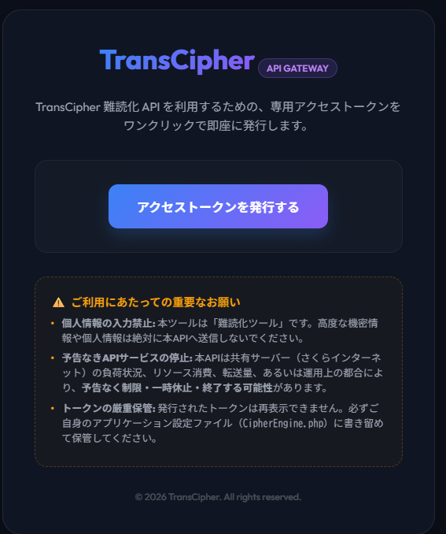
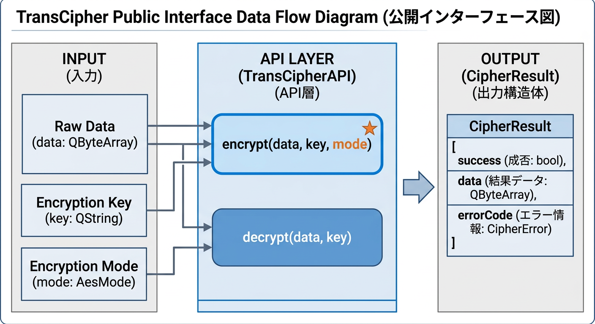
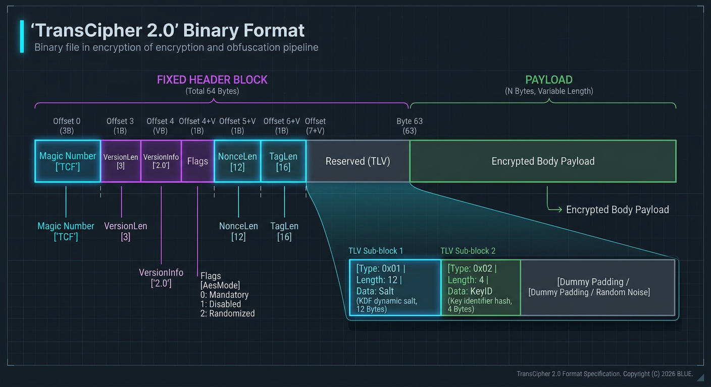

# TransCipher Distribution

多段難読化パイプラインとAES-GCMを組み合わせた、強力かつ柔軟なデータ保護・難読化エンジン「TransCipher」の配布用パッケージです。

## バージョン 2.0.0 (Major Update)
C++版とPHP版の完全互換を達成しました。

## コンテンツ構成

- **bin/**: GUIツール (`TransCipherApp.exe`)、CLIツール (`TransCipherCLI.exe`)、DLL等。
- **php/**: (Ver.2.0 追加) PHP版エンジン本体。
- **include/**: 開発者向けの公開APIヘッダーファイル。
- **lib/**: 開発者向けのインポートライブラリ。

## 使い方 (エンドユーザー)

1. `bin/` フォルダ内の `TransCipherApp.exe` を実行します。
2. 暗号化したいテキストを入力し、秘密鍵を設定して実行してください。

## 使い方 (開発者)

このライブラリを自身のC++プロジェクトに組み込むには、以下のファイルをプロジェクトに含めてください。

1. `include/` 内のヘッダーファイルをインクルード。
2. `lib/` 内のライブラリをリンク。
3. 実行環境に `TransCipher.dll` を配置。

詳しいAPIの使用方法は、`include/cipher_engine.h` を参照してください。

## PHP版エンジンの設定について

Ver.2.0.0 より、PHP版エンジンはセキュリティ向上のため、データの難読化および復元（保護解除）処理を外部のセキュアなAPIサーバーへ委譲する仕様に変更されました。
本パッケージに含まれる [php/CipherEngine.php](file:///D:/prog/C++/TransCipher_Dist/php/CipherEngine.php) をそのまま動かすには、以下の手順で API トークンを設定する必要があります。

### 1. API トークンの取得
以下のトークン発行ゲートウェイページへアクセスし、**「アクセストークンを発行する」** ボタンをクリックして専用のアクセストークンを発行してください。

* **トークン取得URL**: [https://streamers-tool.sakura.ne.jp/TransCipher/](https://streamers-tool.sakura.ne.jp/TransCipher/)



### 2. ソースコードの書き換え
発行されたトークンをコピーし、[php/CipherEngine.php](file:///D:/prog/C++/TransCipher_Dist/php/CipherEngine.php) 内の **24行目** にある `$apiToken` の値を書き換えて保存します。

```php
// php/CipherEngine.php 24行目付近
private static $apiToken = "YOUR_API_TOKEN_HERE"; // ← "YOUR_API_TOKEN_HERE" を取得したトークンに書き換えます
```

これで、PHP版の難読化・データ保護機能が正常に動作するようになります。

## 仕様

### 公開インターフェース
利用者は `CipherEngine` クラスを通じて全てのデータ保護（難読化・復元）処理を行います。


### データフォーマット
難読化・保護されたデータは以下の構造で出力されます。


---

## 免責事項

このソフトウェアは現状有姿で提供されます。作者はこのソフトウェアの使用によって生じた、いかなる損害についても責任を負いません。
ソースコードは非公開ですが、公開APIを通じた自由な利用を歓迎します。

### 技術的位置づけと安全規格・法規制に関する声明（2026/05/18 追記）
* **難読化・リバースエンジニアリング防止目的**:
  本ソフトウェアは、データの改ざん防止、覗き見防止、および知的財産の保護を主目的とする **「データ保護・難読化（難視化）ツール」** です。
* **公的規格（FIPS / NIST）の非該当**:
  米国政府等の公的調達基準である **FIPS 140** や **NIST** の暗号製品認証の取得・準拠を前提とする「公的暗号化製品」には該当しません。軍用・政府用等の厳格な暗号認証が必要なシステムへの利用は意図しておりません。
* **安全保障貿易管理（輸出管理）について**:
  本ソフトウェアは知的財産保護およびリバースエンジニアリング防止のための技術であり、外為法および関連する安全保障貿易管理における**「輸出規制（リスト規制）」の制限対象となる暗号機能には抵触しない（非該当である）**と判断しています。したがって、本ライブラリを組み込んだアプリケーションを国内外へ配布・公開するにあたり、これら輸出管理規則の違反や抵触を懸念する必要はありません。


## ライセンス

本プロジェクトは独自ライセンス（Proprietary License）を採用しています。
本ソフトウェアに対するリバースエンジニアリング、逆アセンブル、逆コンパイル等は原則として禁止します。ただし、本ソフトウェアが利用している LGPLv3 ライセンスの対象物（Qtライブラリ）の修正やデバッグを目的とした、法令および LGPLv3 に基づいて認められる範囲のリバースエンジニアリング行為については、この制限から除外されます。

### クレジット表記について（開発者向け）

本ソフトウェアを自身のアプリケーションに組み込んで配布する場合、アプリケーション内の「バージョン情報」や「ライセンス一覧」等に、以下のいずれかの形式で権利表記を行ってください。

**表記例 1（シンプル）:**
> Includes TransCipher, Copyright (c) 2026 BLUE000.

**表記例 2（サードパーティ・ライセンス項目として）:**
> This software uses TransCipher library.
> Copyright (c) 2026 BLUE000.

※ アプリケーション全体の著作権者（あなた）と、ライブラリの著作権者（BLUE000）が区別できるよう、混同を避ける形で記載してください。

### サードパーティ・ライセンス (Third-Party Licenses)

本ソフトウェアの一部（`bin/TransCipherApp.exe`）および `bin/TransCipher.dll` は、オープンソース版の **Qt 6 (LGPLv3)** を動的リンク（Dynamic Link）の形式で利用しています。
本ソフトウェアを第三者に配布または利用する際は、LGPLv3のライセンス条項に従ってください。
利用者はLGPLv3の規約に基づき、本ソフトウェアで使用されているQtライブラリを任意の互換性のあるバージョンと差し替えて利用・デバッグする権利を有します。

* **Qt 6 (LGPLv3)**: The Qt Company 等によって開発されています。詳細は [Qt 公式サイト](https://www.qt.io/) を参照してください。
* **GNU LGPLv3 ライセンス全文**: [https://www.gnu.org/licenses/lgpl-3.0.html](https://www.gnu.org/licenses/lgpl-3.0.html)
* **著作権表記**:
  > Qt is licensed under the GNU Lesser General Public License (LGPL) version 3.
  > Copyright (C) 2024 The Qt Company Ltd and other contributors.

